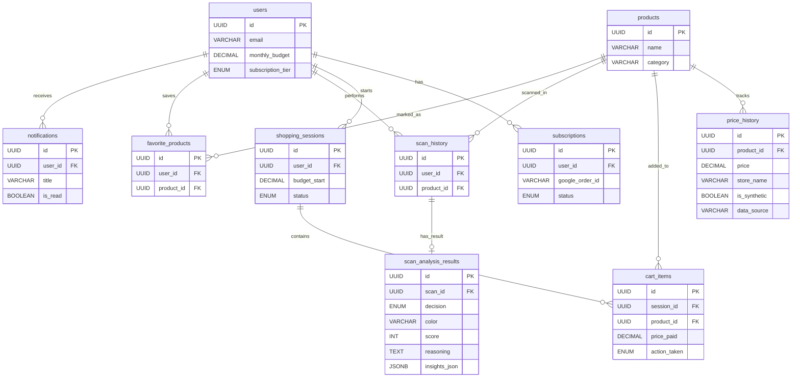

# 🗄️ Entity Relationship Diagram (ERD) & Database Architecture
# **WorthIt — Asisten Validasi Keputusan Belanja In-Store**

Dokumen ini mendefinisikan skema database tersentralisasi untuk aplikasi WorthIt. Desain ini menggunakan pendekatan Normalisasi (memisahkan Master Data dan Transaksi) untuk memastikan integritas data, mendukung model bisnis Freemium, serta memfasilitasi kebutuhan analitik dan tracking riwayat harga. Standar yang digunakan adalah Enterprise Grade dengan penentuan tipe data presisi, foreign key constraints, strategi indexing, dan audit trails.

---

## 1. Visual Diagram (ERD)

---

## 2. Skema Tabel

### 2.1 Tabel `users`
*Deskripsi: Menyimpan profil, preferensi budget, dan status langganan pengguna (Freemium Model).*
- `id` : UUID [PK]
- `email` : VARCHAR(255) [UNIQUE, NOT NULL]
- `full_name` : VARCHAR(255) [NOT NULL]
- `monthly_budget` : DECIMAL(12,2) [DEFAULT 0.00]
- `subscription_tier` : ENUM('FREE', 'PRO') [DEFAULT 'FREE']
- `pro_expires_at` : TIMESTAMP [NULLABLE]
- `monthly_scan_count` : INT [DEFAULT 0] — *Limit penggunaan fitur scan untuk Free user.*
- `last_scan_reset_date` : TIMESTAMP [NULLABLE]
- `created_at` : TIMESTAMP [DEFAULT CURRENT_TIMESTAMP]
- `updated_at` : TIMESTAMP [DEFAULT CURRENT_TIMESTAMP ON UPDATE CURRENT_TIMESTAMP]

**Indexes:**
- B-Tree Index on `email`
- B-Tree Index on `subscription_tier`

### 2.2 Tabel `subscriptions`
*Deskripsi: Mencatat riwayat transaksi langganan dari Google Play Billing.*
- `id` : UUID [PK]
- `user_id` : UUID [FK to users.id, ON DELETE CASCADE]
- `google_order_id` : VARCHAR(255) [UNIQUE, NOT NULL]
- `purchase_token` : TEXT [UNIQUE, NOT NULL]
- `status` : ENUM('ACTIVE', 'CANCELED', 'EXPIRED') [NOT NULL]
- `purchased_at` : TIMESTAMP [NOT NULL]
- `created_at` : TIMESTAMP [DEFAULT CURRENT_TIMESTAMP]
- `updated_at` : TIMESTAMP [DEFAULT CURRENT_TIMESTAMP ON UPDATE CURRENT_TIMESTAMP]

**Indexes:**
- B-Tree Index on `user_id`
- B-Tree Index on `google_order_id`
- B-Tree Index on `status`

### 2.3 Tabel `products`
*Deskripsi: Menyimpan data master produk FMCG yang terstandarisasi.*
- `id` : UUID [PK]
- `name` : VARCHAR(255) [NOT NULL]
- `brand` : VARCHAR(100) [NULLABLE]
- `category` : VARCHAR(100) [NOT NULL]
- `base_weight_gram` : DECIMAL(10,2) [NOT NULL]
- `image_url` : VARCHAR(255) [NULLABLE]
- `created_at` : TIMESTAMP [DEFAULT CURRENT_TIMESTAMP]
- `updated_at` : TIMESTAMP [DEFAULT CURRENT_TIMESTAMP ON UPDATE CURRENT_TIMESTAMP]

**Indexes:**
- B-Tree Index on `category`
- B-Tree Index on `brand`
- Full-Text Index on `name` (untuk pencarian produk)

### 2.4 Tabel `price_history`
*Deskripsi: Mencatat riwayat fluktuasi harga produk dari waktu ke waktu dan berbagai toko (Core Data untuk WMA), termasuk pemisahan eksplisit antara data riil dan data sintetis untuk kebutuhan backtesting, audit algoritma, dan pelacakan provenance data.*
- `id` : UUID [PK]
- `product_id` : UUID [FK to products.id, ON DELETE CASCADE]
- `price` : DECIMAL(12,2) [NOT NULL]
- `weight_gram` : DECIMAL(10,2) [NOT NULL]
- `store_name` : VARCHAR(100) [NULLABLE]
- `is_synthetic` : BOOLEAN [DEFAULT FALSE] — *Menandai apakah record berasal dari generator sintetis (`TRUE`) atau observasi riil (`FALSE`).*
- `data_source` : VARCHAR(100) [NOT NULL] — *Asal data, misalnya `WAYBACK_MACHINE`, `SYNTHETIC_GENERATOR`, `SCRAPER_KLIKINDOMARET`, `SCRAPER_ALFAGIFT`, atau `MANUAL_ENTRY`.*
- `recorded_at` : TIMESTAMP [DEFAULT CURRENT_TIMESTAMP]
- `created_at` : TIMESTAMP [DEFAULT CURRENT_TIMESTAMP]
- `updated_at` : TIMESTAMP [DEFAULT CURRENT_TIMESTAMP ON UPDATE CURRENT_TIMESTAMP]

**Indexes:**
- B-Tree Index on `product_id`
- B-Tree Index on `recorded_at` (Sangat penting untuk query historis / WMA)
- Composite Index on `(product_id, recorded_at)`
- Composite Index on `(product_id, is_synthetic, recorded_at)` untuk memisahkan query training dan query produksi
- B-Tree Index on `data_source` untuk audit ingestion pipeline

### 2.5 Tabel `shopping_sessions`
*Deskripsi: Mencatat satu sesi berbelanja (sekali datang ke toko).*
- `id` : UUID [PK]
- `user_id` : UUID [FK to users.id, ON DELETE CASCADE]
- `budget_start` : DECIMAL(12,2) [NOT NULL]
- `status` : ENUM('ACTIVE', 'COMPLETED') [DEFAULT 'ACTIVE']
- `created_at` : TIMESTAMP [DEFAULT CURRENT_TIMESTAMP]
- `updated_at` : TIMESTAMP [DEFAULT CURRENT_TIMESTAMP ON UPDATE CURRENT_TIMESTAMP]

**Indexes:**
- B-Tree Index on `user_id`
- B-Tree Index on `status`
- B-Tree Index on `created_at`

### 2.6 Tabel `cart_items`
*Deskripsi: Menyimpan produk yang dipindai dan tindakan akhir yang diambil oleh pengguna dalam sebuah sesi. Tabel ini berkolaborasi dengan `shopping_sessions` untuk menopang UI "Aktivitas Belanja" di halaman Dashboard dan Pengeluaran.*
- `id` : UUID [PK]
- `session_id` : UUID [FK to shopping_sessions.id, ON DELETE CASCADE]
- `product_id` : UUID [FK to products.id, ON DELETE RESTRICT]
- `price_paid` : DECIMAL(12,2) [NOT NULL]
- `action_taken` : ENUM('BUY', 'SUBSTITUTE', 'SKIP') [NOT NULL]
- `decision_score` : INT [NULLABLE]
- `wma_insight` : TEXT [NULLABLE]
- `snr_insight` : TEXT [NULLABLE]
- `is_fake_discount` : BOOLEAN [DEFAULT FALSE]
- `is_shrinkflation` : BOOLEAN [DEFAULT FALSE]
- `created_at` : TIMESTAMP [DEFAULT CURRENT_TIMESTAMP]
- `updated_at` : TIMESTAMP [DEFAULT CURRENT_TIMESTAMP ON UPDATE CURRENT_TIMESTAMP]

**Indexes:**
- B-Tree Index on `session_id`
- B-Tree Index on `product_id`
- B-Tree Index on `action_taken`
- Composite Index on `(session_id, action_taken)`

### 2.7 Tabel `scan_history`
*Deskripsi: Menyimpan riwayat setiap kali pengguna memindai label harga, untuk keperluan analitik dan tracking limit. **Kebijakan Retensi Data (TTL):** Data pada tabel ini memiliki batas masa aktif maksimal 30 hari (1 bulan). Data yang lebih tua dari 30 hari akan dihapus otomatis (via cron job atau mekanisme DB) untuk menghemat storage dan menjaga performa.*
- `id` : UUID [PK]
- `user_id` : UUID [FK to users.id, ON DELETE CASCADE]
- `product_id` : UUID [FK to products.id, ON DELETE CASCADE]
- `scan_result_score` : INT [NULLABLE]
- `created_at` : TIMESTAMP [DEFAULT CURRENT_TIMESTAMP]
- `updated_at` : TIMESTAMP [DEFAULT CURRENT_TIMESTAMP ON UPDATE CURRENT_TIMESTAMP]

**Indexes:**
- B-Tree Index on `user_id`
- B-Tree Index on `product_id`
- B-Tree Index on `created_at`

### 2.8 Tabel `scan_analysis_results`
*Deskripsi: Menyimpan "snapshot" hasil analisis yang berelasi 1-to-1 dengan `scan_history` agar Bottom Sheet Analisis bisa dimunculkan kembali dari halaman history. **Kebijakan Retensi Data (TTL):** Sama seperti `scan_history`, data pada tabel ini dibatasi maksimal 30 hari dan dihapus otomatis setelahnya.*
- `id` : UUID [PK]
- `scan_id` : UUID [FK to scan_history.id, ON DELETE CASCADE]
- `decision` : ENUM('BUY', 'SUBSTITUTE', 'DONT_BUY')
- `color` : VARCHAR(20)
- `score` : INT
- `reasoning` : TEXT
- `insights_json` : JSONB

**Indexes:**
- B-Tree Index on `scan_id`

### 2.9 Tabel `favorite_products`
*Deskripsi: Mencatat produk-produk yang ditandai atau sering dibeli pengguna.*
- `id` : UUID [PK]
- `user_id` : UUID [FK to users.id, ON DELETE CASCADE]
- `product_id` : UUID [FK to products.id, ON DELETE CASCADE]
- `created_at` : TIMESTAMP [DEFAULT CURRENT_TIMESTAMP]
- `updated_at` : TIMESTAMP [DEFAULT CURRENT_TIMESTAMP ON UPDATE CURRENT_TIMESTAMP]

**Indexes:**
- B-Tree Index on `user_id`
- B-Tree Index on `product_id`
- Composite Unique Index on `(user_id, product_id)` (Mencegah duplikasi favorit)

### 2.9 Tabel `notifications`
*Deskripsi: Pesan masuk untuk pengguna, seperti masa langganan mau habis, update harga, dsb.*
- `id` : UUID [PK]
- `user_id` : UUID [FK to users.id, ON DELETE CASCADE]
- `title` : VARCHAR(255) [NOT NULL]
- `message` : TEXT [NOT NULL]
- `is_read` : BOOLEAN [DEFAULT FALSE]
- `created_at` : TIMESTAMP [DEFAULT CURRENT_TIMESTAMP]
- `updated_at` : TIMESTAMP [DEFAULT CURRENT_TIMESTAMP ON UPDATE CURRENT_TIMESTAMP]

**Indexes:**
- B-Tree Index on `user_id`
- B-Tree Index on `is_read`

---

## 3. Strategi Data Statistik (Tanpa Tabel Agregasi)

Perlu dicatat bahwa **WorthIt tidak menggunakan tabel agregasi terpisah** untuk kalkulasi halaman Statistik (Detail per Kategori, Tren 6 Bulan, Top 3 Pengeluaran). 

Data analitik tersebut dihasilkan secara real-time melalui **SQL Aggregation (Query)** dari tabel operasional yang sudah ada. Pendekatan ini memastikan data statistik selalu sinkron dengan data transaksi terbaru tanpa redundansi penyimpanan.

**Contoh Mekanisme Agregasi:**
- Menggunakan data dari tabel `cart_items` (difilter dengan kondisi `action_taken = 'BUY'`).
- Melakukan operasi `JOIN` dengan tabel `products` untuk mendapatkan kolom `category` dan `name`.
- Fungsi SQL agregasi seperti `SUM()`, `COUNT()`, dan `GROUP BY` digunakan untuk merangkum total pengeluaran per kategori atau menemukan item yang paling banyak menyerap anggaran.
- **Optimasi:** Composite Index pada `cart_items(session_id, action_taken)` dan Index pada `products(category)` dirancang khusus untuk memastikan query agregasi ini berjalan dalam hitungan milidetik.

---

## 4. Integritas Data & Audit Trail

Arsitektur database WorthIt dirancang untuk menjaga **data lineage** dari setiap titik harga yang masuk ke sistem. Dengan penambahan kolom `is_synthetic` dan `data_source` pada tabel `price_history`, sistem dapat membedakan secara deterministik antara:

- **Data riil**: hasil scraping terkini, pengambilan arsip Wayback Machine, atau input manual tervalidasi.
- **Data sintetis**: data simulasi cerdas yang dihasilkan untuk melengkapi gap historis 6 bulan pertama.

Pemisahan ini penting untuk tiga kebutuhan inti:

1. **Audit algoritma** — saat mengevaluasi performa WMA, support/resistance, dan deteksi anomali, tim dapat menghitung metrik secara terpisah antara data riil murni, data hybrid, dan data sintetis penuh.
2. **Reproducibility** — setiap eksperimen backtesting dapat direkonstruksi ulang berdasarkan kombinasi `product_id`, `recorded_at`, `is_synthetic`, dan `data_source`.
3. **Kontrol kualitas ingestion** — apabila ditemukan outlier harga, tim dapat melacak apakah sumbernya berasal dari scraper tertentu, arsip Wayback Machine, atau modul generator sintetis.

Secara operasional, aturan integritas yang disarankan adalah:

- Record dengan `is_synthetic = TRUE` harus memiliki `data_source = 'SYNTHETIC_GENERATOR'`.
- Record dengan `data_source = 'WAYBACK_MACHINE'` atau prefix `SCRAPER_` harus disimpan dengan `is_synthetic = FALSE`.
- Query produksi untuk rekomendasi harian memprioritaskan data riil terbaru, sedangkan query backtesting dapat menggabungkan data riil dan sintetis secara eksplisit sesuai skenario pengujian.
