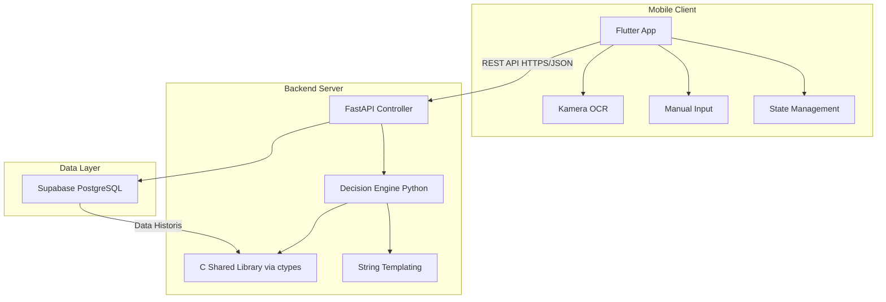
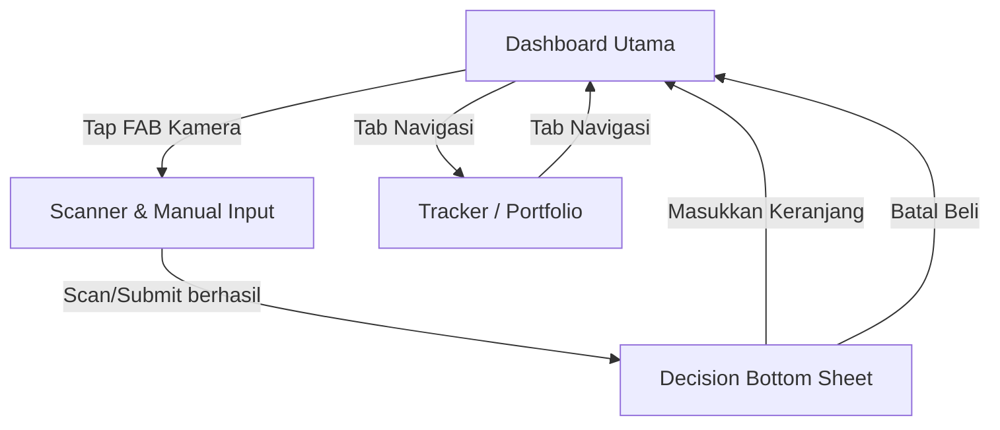
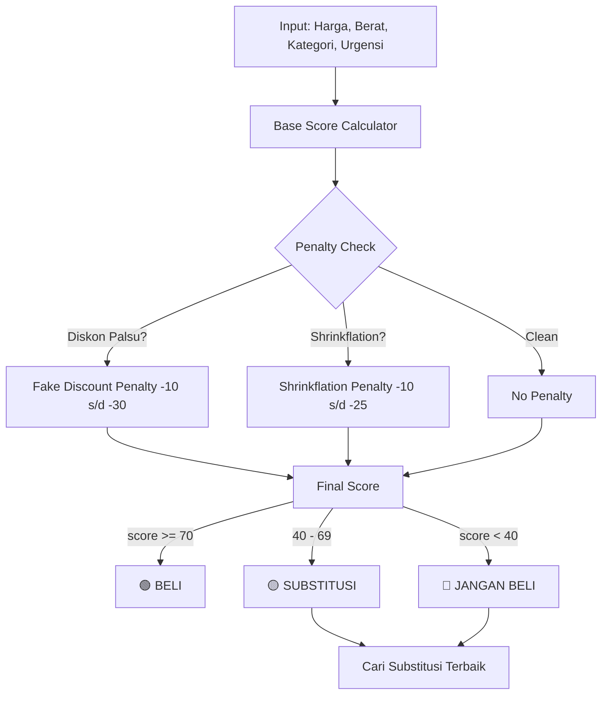

# 📋 Product Requirements Document (PRD)
# **WorthIt — Asisten Validasi Keputusan Belanja In-Store**

> **Versi:** 1.0 · **Tanggal:** 5 Mei 2026  
> **Kompetisi:** Gemastik — Divisi Pengembangan Perangkat Lunak  
> **Dokumen:** Bagian 1 dari 2

---

## Daftar Isi — Bagian 1

1. [Executive Summary](#1-executive-summary)
2. [Latar Belakang & Rumusan Masalah](#2-latar-belakang--rumusan-masalah)
3. [Solusi & Value Proposition](#3-solusi--value-proposition)
4. [Tech Stack & Justifikasi](#4-tech-stack--justifikasi)
5. [Arsitektur Sistem](#5-arsitektur-sistem)
6. [Arsitektur Layar (Screen Flow)](#6-arsitektur-layar-screen-flow)
7. [Logika Keputusan (Core Engine)](#7-logika-keputusan-core-engine)

---

## 1. Executive Summary

**WorthIt** adalah aplikasi mobile yang bertindak sebagai *asisten belanja real-time* di dalam toko ritel. Aplikasi ini memecahkan masalah **asimetri informasi konsumen** — kondisi di mana pembeli tidak memiliki cukup data untuk menilai apakah harga yang tertera di rak benar-benar "worth it".

Dengan kombinasi **OCR scan label harga**, **analisis data historis**, dan **deteksi ilusi diskon**, WorthIt memberikan instruksi keputusan dalam **< 1 detik**:

| Sinyal | Warna | Aksi |
|--------|-------|------|
| **BELI** | 🟢 Hijau | Harga optimal, layak dibeli |
| **SUBSTITUSI** | 🟡 Kuning | Ada alternatif lebih hemat |
| **JANGAN BELI** | 🔴 Merah | Harga tidak wajar / terdeteksi manipulasi |

**Diferensiasi Teknis untuk Gemastik:** Core engine pencarian data ditulis dalam **bahasa C** (compiled sebagai shared library), dipanggil oleh Python via `ctypes` — mendemonstrasikan penguasaan low-level optimization di atas arsitektur modern.

---

## 2. Latar Belakang & Rumusan Masalah

### 2.1 Konteks Ekonomi

Inflasi dan strategi pricing ritel modern menciptakan tiga ancaman bagi konsumen:

| # | Masalah | Deskripsi | Dampak |
|---|---------|-----------|--------|
| 1 | **Anchoring Effect** | Harga "coret" yang dibuat tinggi secara artifisial agar diskon terlihat besar | Konsumen membayar harga normal namun merasa mendapat diskon |
| 2 | **Shrinkflation** | Pengurangan isi/gramasi produk tanpa mengubah harga | Konsumen membayar lebih mahal per satuan tanpa menyadarinya |
| 3 | **Asimetri Informasi** | Konsumen tidak punya akses riwayat harga saat berdiri di depan rak | Keputusan belanja berbasis emosi, bukan data |

### 2.2 Persona Target

**Rina (25 tahun)** — Pekerja kantoran di kota besar, belanja mingguan di supermarket dengan budget terbatas. Sering tergoda diskon besar namun curiga apakah diskon tersebut benar-benar menguntungkan. Tidak punya waktu untuk riset harga satu per satu.

### 2.3 Problem Statement

> *"Bagaimana konsumen dapat memvalidasi keputusan belanja secara instan saat berada di toko, tanpa bergantung pada intuisi atau klaim diskon dari retailer?"*

---

## 3. Solusi & Value Proposition

### 3.1 Solusi

WorthIt adalah **mesin pengambil keputusan belanja real-time** yang:
1. **Membaca** label harga via kamera (OCR) atau input manual
2. **Menganalisis** data historis harga dan gramasi produk
3. **Mendeteksi** anomali (diskon palsu, shrinkflation)
4. **Memberikan** instruksi beli/substitusi/jangan beli dengan alasan terukur
5. **Melacak** budget dan penghematan per sesi belanja

### 3.2 Value Proposition Canvas

| Untuk Konsumen | Metrik |
|----------------|--------|
| Hemat uang dari pembelian tidak perlu | % uang terselamatkan per bulan |
| Keputusan belanja berbasis data | Waktu keputusan < 1 detik |
| Deteksi manipulasi harga | Hit rate deteksi diskon palsu |
| Tracking pengeluaran otomatis | Visualisasi portfolio bulanan |

### 3.3 Keunggulan Kompetitif

| Aspek | Aplikasi Sejenis | WorthIt |
|-------|-------------------|---------|
| Pendekatan | Perbandingan harga antar toko | Validasi harga di rak saat itu juga |
| Kecepatan | Butuh browsing manual | < 1 detik (scan & result) |
| Deteksi manipulasi | Tidak ada | Diskon palsu + Shrinkflation |
| Arsitektur | Full high-level | C engine + Python + Flutter |

---

## 4. Tech Stack & Justifikasi

### 4.1 Stack Overview

```
┌─────────────────────────────────────────┐
│            FLUTTER (Dart)               │
│     UI · Kamera OCR · State Mgmt       │
├─────────────────────────────────────────┤
│          REST API (HTTPS/JSON)          │
├─────────────────────────────────────────┤
│           PYTHON (FastAPI)              │
│    Controller · Templating · Router     │
├──────────────────┬──────────────────────┤
│   C SHARED LIB   │     SUPABASE        │
│  .so/.dll via     │   PostgreSQL +      │
│  ctypes           │   Auth + Storage    │
└──────────────────┴──────────────────────┘
```

### 4.2 Justifikasi Pemilihan

| Teknologi | Alasan | Relevansi Gemastik |
|-----------|--------|-------------------|
| **Flutter** | Cross-platform, hot reload, widget kamera bawaan | Demonstrasi satu codebase untuk Android & iOS |
| **FastAPI** | Async, auto-docs (Swagger), validasi Pydantic | API terstruktur dan testable |
| **C (Shared Library)** | Performa O(log n) untuk binary search pada dataset besar | **Menunjukkan kemampuan low-level programming** — poin differensiasi utama di hadapan juri |
| **Supabase** | PostgreSQL managed, auth built-in, realtime | Rapid development tanpa manage infra sendiri |

### 4.3 C Shared Library — Detail Teknis

```c
// worthit_engine.c — Contoh interface
typedef struct {
    char product_name[128];
    double price;
    double weight_gram;
    long timestamp;
} PriceRecord;

// Binary search pada array sorted by product_id + timestamp
int binary_search_price(PriceRecord* records, int n,
                        const char* product_id, long target_ts);

// Sequential search untuk fuzzy match nama produk
int sequential_search_fuzzy(PriceRecord* records, int n,
                            const char* query, double threshold);
```

**Kompilasi:**
```bash
# Linux (.so)
gcc -shared -fPIC -O2 -o worthit_engine.so worthit_engine.c

# Windows (.dll)
gcc -shared -O2 -o worthit_engine.dll worthit_engine.c
```

**Pemanggilan dari Python:**
```python
import ctypes

engine = ctypes.CDLL("./worthit_engine.so")
engine.binary_search_price.restype = ctypes.c_int
engine.binary_search_price.argtypes = [
    ctypes.POINTER(PriceRecord), ctypes.c_int,
    ctypes.c_char_p, ctypes.c_long
]
```

---

## 5. Arsitektur Sistem

### 5.1 High-Level Architecture



### 5.2 Request-Response Flow

```
User Scan/Input
      │
      ▼
  Flutter App ──POST /api/v1/analyze──► FastAPI
      │                                    │
      │                              ┌─────┴─────┐
      │                              │ Load data  │
      │                              │ from       │
      │                              │ Supabase   │
      │                              └─────┬─────┘
      │                                    │
      │                              ┌─────┴─────┐
      │                              │ C Engine   │
      │                              │ search &   │
      │                              │ compute    │
      │                              └─────┬─────┘
      │                                    │
      │                              ┌─────┴─────┐
      │                              │ Score +    │
      │                              │ Template   │
      │                              │ reasoning  │
      │                              └─────┬─────┘
      │                                    │
      ◄──────── JSON Response ─────────────┘
```

### 5.3 Data Model (ERD Konseptual)

| Tabel | Kolom Kunci | Deskripsi |
|-------|-------------|-----------|
| `users` | id, email, monthly_budget | Data pengguna |
| `products` | id, name, category, brand, current_weight_gram | Master produk |
| `price_history` | id, product_id, price, weight_gram, store, recorded_at | Riwayat harga (data inti untuk WMA) |
| `shopping_sessions` | id, user_id, budget_start, budget_remaining, created_at | Sesi belanja aktif |
| `cart_items` | id, session_id, product_id, price_paid, decision_score, action_taken | Item yang diputuskan user |
| `substitutions` | id, product_id, substitute_product_id, price_per_gram_ratio | Mapping substitusi |

---

## 6. Arsitektur Layar (Screen Flow)

### 6.1 Navigation Map



### 6.2 Screen A — Dashboard Utama

**Tujuan:** Landing page yang memberi gambaran instan status keuangan belanja.

| Komponen | Detail |
|----------|--------|
| **Header** | Greeting + nama user |
| **Budget Card** | Progress bar sisa budget bulanan (Rp). Warna berubah: hijau (>50%), kuning (25-50%), merah (<25%) |
| **Metrik Utama** | Card "Uang Terselamatkan" — total penghematan dari keputusan "Batal Beli" bulan ini |
| **Aktivitas Terbaru** | List 5 item terakhir yang dianalisis (nama, harga, status hijau/kuning/merah) |
| **FAB (Floating Action Button)** | Tombol kamera besar di tengah bawah. Primary CTA untuk memulai scan |

**State yang dikelola:**
```dart
class DashboardState {
  double monthlyBudget;
  double budgetRemaining;
  double moneySaved;
  List<RecentActivity> recentItems;
}
```

### 6.3 Screen B — Scanner & Manual Input

**Tujuan:** Capture data produk dari rak toko — baik via OCR maupun ketik manual.

| Komponen | Detail |
|----------|--------|
| **Kamera View** | Separuh atas layar. Overlay kotak guide untuk framing label harga |
| **OCR Result Preview** | Teks hasil scan ditampilkan real-time di atas kamera |
| **Form Manual Input** | Selalu visible di separuh bawah (bukan hidden/fallback). Fields: Nama Produk, Harga (Rp), Berat/Volume (gram/ml), Kategori (dropdown) |
| **Toggle** | Switch antara mode "Kamera" dan "Manual Only" |
| **Tombol Submit** | "🔍 Analisis Sekarang" |

> **Desain Inklusif:** Form manual bukan fallback — ini fitur setara. User yang tidak nyaman dengan kamera atau produknya sulit di-scan bisa langsung ketik.

**Input yang dikirim ke API:**
```json
{
  "product_name": "Indomie Goreng",
  "price": 3500,
  "weight_gram": 80,
  "category": "mie_instan",
  "urgency": 3,
  "session_id": "uuid-session"
}
```

### 6.4 Screen C — Decision Bottom Sheet

**Tujuan:** Menyajikan hasil analisis dan meminta keputusan final user.

| Komponen | Detail |
|----------|--------|
| **Status Badge** | Lingkaran besar di atas: 🟢 BELI / 🟡 SUBSTITUSI / 🔴 JANGAN BELI |
| **Skor** | Angka 0-100 dengan ring progress |
| **Insight Cards** | 2-3 card berisi alasan keputusan |
| **Substitusi** | (Jika kuning/merah) Card produk alternatif + harga per gram |
| **Tombol Aksi** | `✔️ MASUKKAN KERANJANG` → kurangi budget. `❌ BATAL BELI` → tambah skor penghematan |

**Response dari API:**
```json
{
  "decision": "SUBSTITUTE",
  "color": "yellow",
  "score": 42,
  "insights": [
    "Harga Rp3.500 untuk 80g = Rp43.75/g",
    "Rata-rata 3 bulan terakhir: Rp3.200 (Rp40/g)",
    "⚠️ Terdeteksi kenaikan 9.4% tanpa perubahan kualitas"
  ],
  "substitution": {
    "product_name": "Mie Sedaap Goreng",
    "price": 3000,
    "weight_gram": 86,
    "price_per_gram": 34.88,
    "savings_percent": 20.3
  },
  "reasoning": "Harga Indomie Goreng saat ini berada di atas level resistance Rp3.300. Disarankan beralih ke Mie Sedaap yang menawarkan rasio harga/gram 20% lebih hemat."
}
```

### 6.5 Screen D — Tracker / Portfolio

**Tujuan:** Analitik pengeluaran bulanan untuk refleksi pola belanja.

| Komponen | Detail |
|----------|--------|
| **Pie Chart** | Grafik donat pengeluaran per kategori (makanan, minuman, snack, dll.) |
| **Summary Cards** | Total belanja, jumlah item, rata-rata per item |
| **Daftar Pembelian** | List scrollable semua item bulan ini: nama, harga, tanggal, skor keputusan |
| **Filter** | Dropdown bulan/minggu |

---

## 7. Logika Keputusan (Core Engine)

### 7.1 Arsitektur Skoring — Single Point of Entry



### 7.2 Base Score — Tiga Komponen

#### A. Weighted Moving Average (WMA)

Memprediksi tren harga berdasarkan data historis 6 bulan:

```
WMA = Σ(Wi × Pi) / Σ(Wi)

Wi = bobot (data terbaru berbobot lebih tinggi)
Pi = harga pada periode i
```

| Periode | Bobot | Alasan |
|---------|-------|--------|
| Bulan ini | 6 | Data paling relevan |
| 1 bulan lalu | 5 | Masih sangat relevan |
| 2 bulan lalu | 4 | Relevan |
| 3 bulan lalu | 3 | Cukup relevan |
| 4 bulan lalu | 2 | Kurang relevan |
| 5 bulan lalu | 1 | Baseline |

**Skor WMA (0-40 poin):**
- Harga ≤ WMA → 40 poin (harga di bawah prediksi = bagus)
- Harga 1-10% > WMA → 30 poin
- Harga 10-20% > WMA → 20 poin
- Harga > 20% di atas WMA → 10 poin

#### B. Support/Resistance Level

Menggunakan konsep teknikal dari analisis pasar:
- **Support** = Harga terendah dalam 6 bulan (lantai harga)
- **Resistance** = Harga tertinggi dalam 6 bulan (plafon harga)
- **Posisi** = (Harga saat ini - Support) / (Resistance - Support) × 100%

**Skor S/R (0-30 poin):**
- Posisi 0-25% (dekat support) → 30 poin
- Posisi 25-50% → 22 poin
- Posisi 50-75% → 15 poin
- Posisi 75-100% (dekat resistance) → 5 poin

#### C. Urgensi User

Parameter dari frontend (skala 1-5 yang dipilih user):

**Skor Urgensi (0-30 poin):**
- Urgensi 5 (sangat butuh) → 30 poin
- Urgensi 4 → 24 poin
- Urgensi 3 → 18 poin
- Urgensi 2 → 12 poin
- Urgensi 1 (tidak mendesak) → 6 poin

### 7.3 Faktor Penalti

#### A. Deteksi Diskon Palsu

```python
def detect_fake_discount(current_price, claimed_original, avg_historical):
    if claimed_original > avg_historical * 1.15:  # threshold 15%
        inflation_pct = (claimed_original - avg_historical) / avg_historical
        penalty = min(30, int(inflation_pct * 100))
        return penalty
    return 0
```

#### B. Deteksi Shrinkflation

```python
def detect_shrinkflation(current_weight, historical_weight, current_price, historical_price):
    weight_change = (current_weight - historical_weight) / historical_weight
    price_change = (current_price - historical_price) / historical_price

    if weight_change < -0.03 and price_change >= 0:
        severity = abs(weight_change) * 100
        penalty = min(25, int(severity * 2.5))
        return penalty
    return 0
```

### 7.4 Kalkulasi Final & Threshold

```
Final Score = Base Score - Fake Discount Penalty - Shrinkflation Penalty
Final Score = max(0, min(100, Final Score))
```

| Range Skor | Keputusan | Warna | Aksi |
|------------|-----------|-------|------|
| 70 — 100 | **BELI** | 🟢 Hijau | Harga layak, tidak ada anomali |
| 40 — 69 | **SUBSTITUSI** | 🟡 Kuning | Cari alternatif lebih baik |
| 0 — 39 | **JANGAN BELI** | 🔴 Merah | Harga tidak wajar |

### 7.5 Rekomendasi Substitusi

Ketika skor kuning/merah, sistem mencari substitusi:

```python
def find_best_substitute(product_category, current_price_per_gram):
    candidates = c_engine.search_by_category(product_category)
    candidates.sort(key=lambda x: x.price_per_gram)

    best = candidates[0]
    if best.price_per_gram < current_price_per_gram:
        return {
            "product_name": best.name,
            "price": best.price,
            "weight_gram": best.weight,
            "price_per_gram": best.price_per_gram,
            "savings_percent": round(
                (1 - best.price_per_gram / current_price_per_gram) * 100, 1
            )
        }
    return None
```

### 7.6 Dynamic String Templating

Alih-alih memanggil API LLM (lambat + mahal), reasoning dirakit dari template:

```python
TEMPLATES = {
    "price_above_wma": "Harga {product} saat ini Rp{price:,} berada {pct}% di atas rata-rata {period} bulan terakhir (Rp{wma:,}).",
    "near_resistance": "Harga mendekati level tertinggi 6 bulan (Rp{resistance:,}), berpotensi turun.",
    "fake_discount": "⚠️ Diskon tidak wajar: harga normal Rp{claimed:,} lebih tinggi {pct}% dari historis Rp{avg:,}.",
    "shrinkflation": "⚠️ Shrinkflation: isi turun {delta}g ({pct}%) namun harga tetap.",
    "substitute_found": "Alternatif: {sub_name} (Rp{sub_ppg:.1f}/g) — {savings}% lebih hemat per gram.",
    "good_buy": "✅ Harga kompetitif dan di bawah rata-rata pasar. Layak dibeli."
}
```

---

> **Lanjutan di PRD_WorthIt_Part2.md** — Backtesting, API Contract, Panduan Eksekusi, dan NFR.
