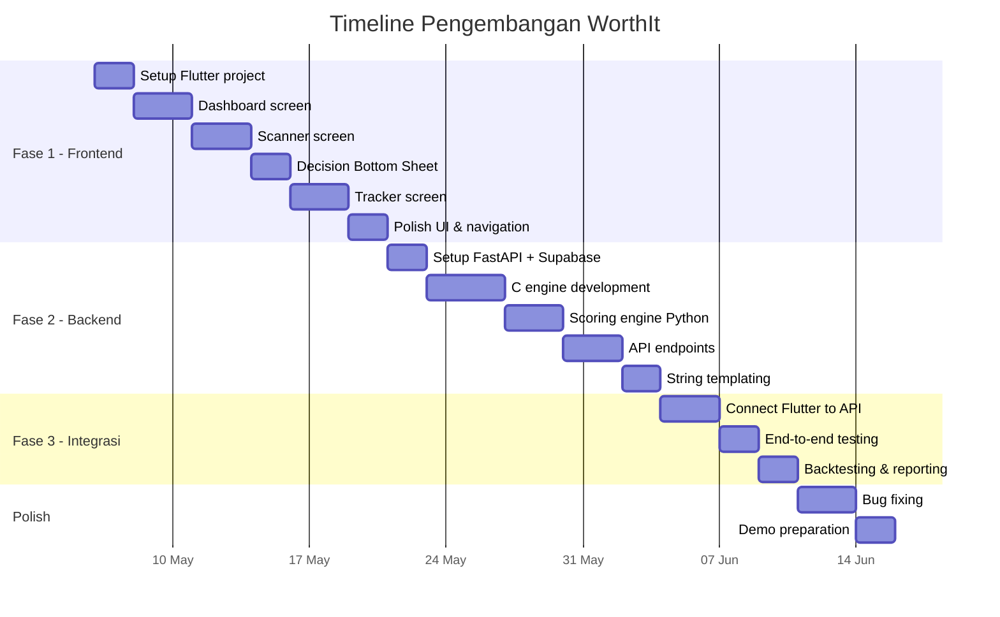

# 📋 Product Requirements Document (PRD) — Bagian 2
# **WorthIt — Asisten Validasi Keputusan Belanja In-Store**

> **Versi:** 1.0 · **Tanggal:** 5 Mei 2026  
> **Kompetisi:** Gemastik — Divisi Pengembangan Perangkat Lunak

---

## Daftar Isi — Bagian 2

8. [Metodologi Pengujian (Backtesting)](#8-metodologi-pengujian-backtesting)
9. [API Contract](#9-api-contract)
10. [Panduan Fase Eksekusi Sekuensial](#10-panduan-fase-eksekusi-sekuensial)
11. [Non-Functional Requirements](#11-non-functional-requirements)
12. [Risk Register](#12-risk-register)
13. [Milestone & Timeline](#13-milestone--timeline)
14. [Lampiran](#14-lampiran)

---

## 8. Metodologi Pengujian (Backtesting)

### 8.1 Filosofi Pengujian

Karena WorthIt adalah **mesin keputusan**, akurasi keputusannya harus diuji secara kuantitatif menggunakan data historis — mirip backtesting pada sistem trading. Bab ini menjadi **pembeda utama** di hadapan juri Gemastik, menunjukkan bahwa sistem bukan sekadar demo UI tetapi memiliki validasi empiris.

### 8.2 Dataset Pengujian

| Parameter | Spesifikasi |
|-----------|-------------|
| **Sumber Data** | Data harga produk FMCG dari supermarket besar (dikumpulkan manual atau dari open dataset) |
| **Rentang Waktu** | 6 bulan terakhir (minimum 180 hari) |
| **Jumlah Produk** | Minimum 50 SKU dari 5 kategori berbeda |
| **Frekuensi** | Minimal 1 data point per minggu per produk |
| **Format** | CSV → diimpor ke Supabase `price_history` |

**Struktur Data Historis:**
```csv
product_id,product_name,category,price,weight_gram,store,recorded_at
P001,Indomie Goreng,mie_instan,3200,85,Alfamart,2025-11-01
P001,Indomie Goreng,mie_instan,3200,85,Alfamart,2025-12-01
P001,Indomie Goreng,mie_instan,3500,80,Alfamart,2026-01-15
...
```

### 8.3 Metrik Pengujian

#### A. Metrik Teknis — Hit Rate (Akurasi Keputusan)

**Definisi:** Persentase keputusan WorthIt yang terbukti benar ketika dibandingkan dengan data harga aktual di masa depan.

**Metodologi Walk-Forward:**
```
Dataset 6 bulan: [M1, M2, M3, M4, M5, M6]

Iterasi 1: Train [M1-M4] → Predict M5 → Compare with actual M5
Iterasi 2: Train [M2-M5] → Predict M6 → Compare with actual M6
```

**Perhitungan:**
```python
def calculate_hit_rate(predictions, actuals):
    correct = 0
    total = len(predictions)

    for pred, actual in zip(predictions, actuals):
        if pred.decision == "BUY" and actual.future_price >= actual.current_price:
            correct += 1  # Benar beli: harga naik di masa depan
        elif pred.decision == "DONT_BUY" and actual.future_price < actual.current_price:
            correct += 1  # Benar tidak beli: harga turun di masa depan
        elif pred.decision == "SUBSTITUTE" and actual.substitute_was_cheaper:
            correct += 1  # Benar substitusi

    return (correct / total) * 100
```

**Target:** Hit Rate ≥ 65% (di atas baseline random 33% untuk 3 kelas keputusan)

#### B. Metrik Bisnis — Cost Savings Impact

**Definisi:** Berapa persen uang yang berhasil dihemat jika user mengikuti semua rekomendasi WorthIt dibanding belanja tanpa panduan.

```python
def calculate_cost_savings(recommendations, actual_prices):
    total_tanpa_worthit = sum(r.current_price for r in recommendations)
    total_dengan_worthit = 0

    for rec in recommendations:
        if rec.decision == "BUY":
            total_dengan_worthit += rec.current_price
        elif rec.decision == "SUBSTITUTE":
            total_dengan_worthit += rec.substitute_price
        else:  # DONT_BUY
            total_dengan_worthit += 0  # Tidak jadi beli

    savings = total_tanpa_worthit - total_dengan_worthit
    savings_pct = (savings / total_tanpa_worthit) * 100
    return savings_pct
```

**Target:** Cost Savings ≥ 15% per sesi belanja (berdasarkan simulasi)

### 8.4 Protokol Pengujian

| Fase | Aktivitas | Output |
|------|-----------|--------|
| 1 | Kumpulkan data 6 bulan, import ke Supabase | Dataset tervalidasi |
| 2 | Jalankan walk-forward backtesting | Confusion matrix per kategori |
| 3 | Hitung Hit Rate per kategori produk | Tabel akurasi per kategori |
| 4 | Simulasi sesi belanja dengan data nyata | Cost Savings percentage |
| 5 | Tuning threshold jika akurasi < target | Parameter optimized |

### 8.5 Format Laporan Backtesting

```
═══════════════════════════════════════
    LAPORAN BACKTESTING WORTHIT v1.0
═══════════════════════════════════════

Dataset  : 50 produk × 6 bulan = 1,200 data points
Periode  : Nov 2025 – Apr 2026
Iterasi  : 2 walk-forward windows

── METRIK TEKNIS ──
Hit Rate Keseluruhan  : 71.3%
  - Kategori Mie      : 75.0%
  - Kategori Susu     : 68.2%
  - Kategori Snack    : 72.1%
  - Kategori Minuman  : 66.7%
  - Kategori Bumbu    : 73.5%

── METRIK BISNIS ──
Cost Savings Impact   : 18.7%
  - Dari "Batal Beli" : 11.2%
  - Dari "Substitusi"  : 7.5%

── DETEKSI ANOMALI ──
Diskon Palsu Terdeteksi    : 12 kasus (8 benar = 66.7%)
Shrinkflation Terdeteksi   : 5 kasus (4 benar = 80.0%)
═══════════════════════════════════════
```

---

## 9. API Contract

### 9.1 Base URL & Convention

```
Base URL : https://api.worthit.app/v1
Format   : JSON
Auth     : Bearer Token (Supabase Auth JWT)
```

### 9.2 Endpoint Specification

#### POST `/v1/analyze` — Analisis Produk (Core)

**Request:**
```json
{
  "product_name": "Indomie Goreng",
  "price": 3500,
  "weight_gram": 80,
  "category": "mie_instan",
  "urgency": 3,
  "session_id": "550e8400-e29b-41d4-a716-446655440000",
  "claimed_original_price": 5000
}
```

**Response (200 OK):**
```json
{
  "status": "success",
  "data": {
    "decision": "SUBSTITUTE",
    "color": "yellow",
    "score": 42,
    "base_score": {
      "wma": 20,
      "support_resistance": 15,
      "urgency": 18
    },
    "penalties": {
      "fake_discount": -8,
      "shrinkflation": -3
    },
    "insights": [
      "Harga Rp3.500 untuk 80g = Rp43.75/g",
      "Rata-rata 3 bulan: Rp3.200 (Rp40/g)",
      "⚠️ Kenaikan 9.4% tanpa perubahan kualitas"
    ],
    "substitution": {
      "product_name": "Mie Sedaap Goreng",
      "price": 3000,
      "weight_gram": 86,
      "price_per_gram": 34.88,
      "savings_percent": 20.3
    },
    "reasoning": "Harga berada di atas level resistance. Disarankan beralih ke Mie Sedaap — 20% lebih hemat per gram."
  }
}
```

#### GET `/v1/dashboard` — Data Dashboard

**Response (200 OK):**
```json
{
  "status": "success",
  "data": {
    "monthly_budget": 2000000,
    "budget_remaining": 1250000,
    "money_saved": 187500,
    "recent_activities": [
      {
        "product_name": "Indomie Goreng",
        "price": 3500,
        "decision": "SUBSTITUTE",
        "color": "yellow",
        "timestamp": "2026-05-05T10:30:00Z"
      }
    ]
  }
}
```

#### POST `/v1/cart/add` — Masukkan Keranjang

**Request:**
```json
{
  "session_id": "uuid",
  "product_name": "Mie Sedaap Goreng",
  "price_paid": 3000,
  "decision_score": 42,
  "action_taken": "buy_substitute"
}
```

#### POST `/v1/cart/skip` — Batal Beli

**Request:**
```json
{
  "session_id": "uuid",
  "product_name": "Indomie Goreng",
  "price_skipped": 3500,
  "decision_score": 42
}
```

#### GET `/v1/tracker` — Data Portfolio/Tracker

**Query Params:** `?month=2026-05`

**Response (200 OK):**
```json
{
  "status": "success",
  "data": {
    "total_spent": 750000,
    "total_items": 23,
    "avg_per_item": 32608,
    "by_category": [
      {"category": "mie_instan", "amount": 150000, "percentage": 20.0},
      {"category": "susu", "amount": 200000, "percentage": 26.7},
      {"category": "snack", "amount": 100000, "percentage": 13.3}
    ],
    "items": [
      {
        "product_name": "Mie Sedaap Goreng",
        "price_paid": 3000,
        "date": "2026-05-05",
        "decision_score": 42
      }
    ]
  }
}
```

### 9.3 Error Response Standard

```json
{
  "status": "error",
  "error": {
    "code": "PRODUCT_NOT_FOUND",
    "message": "Produk tidak ditemukan dalam database.",
    "suggestion": "Coba gunakan nama produk yang lebih umum atau input manual."
  }
}
```

| Error Code | HTTP Status | Keterangan |
|------------|-------------|------------|
| `PRODUCT_NOT_FOUND` | 404 | Produk tidak ada di DB |
| `INSUFFICIENT_HISTORY` | 422 | Data historis < 3 bulan |
| `INVALID_INPUT` | 400 | Field wajib tidak diisi |
| `ENGINE_ERROR` | 500 | C engine crash/timeout |
| `AUTH_REQUIRED` | 401 | Token tidak valid |

---

## 10. Panduan Fase Eksekusi Sekuensial

> **Catatan:** Panduan ini dirancang khusus untuk developer yang baru pertama kali membuat mobile app menggunakan pendekatan "vibe coding" (iteratif, tanpa desain UI/UX formal).

### 10.1 Fase 1 — Frontend (Flutter + Dummy Data)

**Durasi Target:** 2 minggu  
**Goal:** Semua 4 layar berfungsi dengan data hardcode

#### Langkah 1.1: Setup Project

```bash
flutter create worthit_app
cd worthit_app
flutter pub add google_fonts
flutter pub add fl_chart          # untuk pie chart
flutter pub add camera             # untuk kamera
flutter pub add google_mlkit_text_recognition  # OCR
```

#### Langkah 1.2: State Management Sederhana

Gunakan `StatefulWidget` + `setState()` untuk tahap awal. **Jangan langsung pakai Riverpod/BLoC** — terlalu kompleks untuk first-timer.

```dart
// lib/models/product_analysis.dart
class ProductAnalysis {
  final String decision;    // "BUY", "SUBSTITUTE", "DONT_BUY"
  final String color;       // "green", "yellow", "red"
  final int score;
  final List<String> insights;
  final String reasoning;
  final Substitution? substitution;

  ProductAnalysis({
    required this.decision, required this.color,
    required this.score, required this.insights,
    required this.reasoning, this.substitution,
  });
}
```

#### Langkah 1.3: Dummy Data Service

```dart
// lib/services/dummy_data.dart
class DummyDataService {
  static ProductAnalysis getDummyAnalysis() {
    return ProductAnalysis(
      decision: "SUBSTITUTE",
      color: "yellow",
      score: 42,
      insights: [
        "Harga Rp3.500 untuk 80g = Rp43.75/g",
        "Rata-rata 3 bulan: Rp3.200 (Rp40/g)",
        "⚠️ Kenaikan 9.4%",
      ],
      reasoning: "Harga di atas level resistance.",
      substitution: Substitution(
        productName: "Mie Sedaap Goreng",
        price: 3000, weightGram: 86,
        pricePerGram: 34.88, savingsPercent: 20.3,
      ),
    );
  }

  static DashboardData getDummyDashboard() {
    return DashboardData(
      monthlyBudget: 2000000,
      budgetRemaining: 1250000,
      moneySaved: 187500,
      recentItems: [
        RecentActivity(name: "Indomie", price: 3500, color: "yellow"),
        RecentActivity(name: "Susu Ultra", price: 12000, color: "green"),
        RecentActivity(name: "Chitato", price: 15000, color: "red"),
      ],
    );
  }
}
```

#### Langkah 1.4: Struktur Folder

```
lib/
├── main.dart
├── models/
│   ├── product_analysis.dart
│   ├── dashboard_data.dart
│   └── tracker_data.dart
├── screens/
│   ├── dashboard_screen.dart
│   ├── scanner_screen.dart
│   ├── decision_bottom_sheet.dart
│   └── tracker_screen.dart
├── services/
│   ├── dummy_data.dart          ← Fase 1
│   └── api_service.dart         ← Fase 3
└── widgets/
    ├── budget_card.dart
    ├── score_ring.dart
    └── category_pie_chart.dart
```

#### Checklist Fase 1

- [ ] Dashboard menampilkan budget card + recent activity
- [ ] FAB membuka scanner screen
- [ ] Scanner menampilkan kamera + form manual
- [ ] Submit menampilkan Decision Bottom Sheet dengan dummy data
- [ ] Tombol "Masukkan Keranjang" dan "Batal Beli" kembali ke dashboard
- [ ] Tracker menampilkan pie chart + daftar item
- [ ] Navigasi antar halaman lancar

---

### 10.2 Fase 2 — Backend (FastAPI + C Engine)

**Durasi Target:** 2 minggu  
**Goal:** Semua endpoint API berfungsi dan bisa ditest via Swagger

#### Langkah 2.1: Setup Project

```bash
mkdir worthit_backend && cd worthit_backend
python -m venv venv
source venv/bin/activate  # Linux/Mac
# atau: venv\Scripts\activate  # Windows
pip install fastapi uvicorn pydantic supabase python-dotenv
```

#### Langkah 2.2: Struktur Folder Backend

```
worthit_backend/
├── main.py                 # Entry point FastAPI
├── .env                    # SUPABASE_URL, SUPABASE_KEY
├── routers/
│   ├── analyze.py          # POST /v1/analyze
│   ├── dashboard.py        # GET /v1/dashboard
│   ├── cart.py             # POST /v1/cart/add, /v1/cart/skip
│   └── tracker.py          # GET /v1/tracker
├── engine/
│   ├── scoring.py          # Logika skoring Python
│   ├── templates.py        # Dynamic string templates
│   ├── c_bridge.py         # ctypes wrapper
│   └── worthit_engine.c    # Source code C
│   └── worthit_engine.so   # Compiled shared library
├── models/
│   ├── request.py          # Pydantic request models
│   └── response.py         # Pydantic response models
└── utils/
    └── supabase_client.py  # Supabase connection
```

#### Langkah 2.3: Pydantic Models

```python
# models/request.py
from pydantic import BaseModel, Field
from typing import Optional

class AnalyzeRequest(BaseModel):
    product_name: str = Field(..., min_length=1, max_length=200)
    price: float = Field(..., gt=0)
    weight_gram: float = Field(..., gt=0)
    category: str
    urgency: int = Field(..., ge=1, le=5)
    session_id: str
    claimed_original_price: Optional[float] = None

# models/response.py
from pydantic import BaseModel
from typing import List, Optional

class SubstitutionResponse(BaseModel):
    product_name: str
    price: float
    weight_gram: float
    price_per_gram: float
    savings_percent: float

class AnalyzeResponse(BaseModel):
    decision: str       # "BUY", "SUBSTITUTE", "DONT_BUY"
    color: str          # "green", "yellow", "red"
    score: int
    insights: List[str]
    reasoning: str
    substitution: Optional[SubstitutionResponse] = None
```

#### Langkah 2.4: Testing via Swagger

```bash
uvicorn main:app --reload --port 8000
# Buka: http://localhost:8000/docs
# Test semua endpoint langsung di browser
```

#### Checklist Fase 2

- [ ] FastAPI berjalan di localhost:8000
- [ ] POST /v1/analyze mengembalikan keputusan yang benar
- [ ] C shared library terkompilasi dan bisa dipanggil via ctypes
- [ ] Data historis di Supabase bisa di-query
- [ ] Dynamic string templating menghasilkan reasoning
- [ ] Semua endpoint bisa ditest via Swagger UI
- [ ] Error handling sesuai tabel error codes

---

### 10.3 Fase 3 — Integrasi (Flutter ↔ FastAPI)

**Durasi Target:** 1 minggu  
**Goal:** Aplikasi end-to-end, data real dari backend

#### Langkah 3.1: Install HTTP Client di Flutter

```bash
flutter pub add http
flutter pub add flutter_dotenv
```

#### Langkah 3.2: API Service (Mengganti Dummy Data)

```dart
// lib/services/api_service.dart
import 'dart:convert';
import 'package:http/http.dart' as http;

class ApiService {
  static const String baseUrl = 'http://10.0.2.2:8000/v1'; // Android emulator
  // Untuk device fisik, ganti dengan IP lokal komputer

  static Future<ProductAnalysis> analyzeProduct(AnalyzeInput input) async {
    final response = await http.post(
      Uri.parse('$baseUrl/analyze'),
      headers: {
        'Content-Type': 'application/json',
        'Authorization': 'Bearer $token',
      },
      body: jsonEncode(input.toJson()),
    );

    if (response.statusCode == 200) {
      final data = jsonDecode(response.body)['data'];
      return ProductAnalysis.fromJson(data);
    } else {
      throw Exception('Gagal menganalisis: ${response.body}');
    }
  }

  static Future<DashboardData> getDashboard() async {
    final response = await http.get(
      Uri.parse('$baseUrl/dashboard'),
      headers: {'Authorization': 'Bearer $token'},
    );

    if (response.statusCode == 200) {
      final data = jsonDecode(response.body)['data'];
      return DashboardData.fromJson(data);
    } else {
      throw Exception('Gagal memuat dashboard');
    }
  }
}
```

#### Langkah 3.3: Switch dari Dummy ke Real

```dart
// Sebelum (Fase 1):
final analysis = DummyDataService.getDummyAnalysis();

// Sesudah (Fase 3):
final analysis = await ApiService.analyzeProduct(input);
```

#### Langkah 3.4: Checklist Integrasi

- [ ] Flutter bisa hit endpoint FastAPI (test dengan print response)
- [ ] Dashboard menampilkan data real dari `/v1/dashboard`
- [ ] Scan/manual input mengirim data ke `/v1/analyze`
- [ ] Decision Bottom Sheet menampilkan result dari API
- [ ] "Masukkan Keranjang" mengirim POST ke `/v1/cart/add`
- [ ] "Batal Beli" mengirim POST ke `/v1/cart/skip`
- [ ] Tracker menampilkan data real dari `/v1/tracker`
- [ ] Error ditampilkan dengan snackbar yang informatif
- [ ] Loading state ditampilkan saat menunggu API

---

## 11. Non-Functional Requirements

| Kategori | Requirement | Target |
|----------|-------------|--------|
| **Performa** | Waktu respons API /analyze | < 1 detik (P95) |
| **Performa** | OCR text extraction | < 2 detik |
| **Performa** | C engine search time | < 10ms untuk 10K records |
| **Ketersediaan** | Uptime backend | 99% selama demo |
| **Keamanan** | Autentikasi | JWT via Supabase Auth |
| **Keamanan** | Transmisi data | HTTPS only |
| **UX** | Minimum tap to result | ≤ 3 tap (buka app → scan → lihat hasil) |
| **Kompatibilitas** | Android minimum | API Level 24 (Android 7.0) |
| **Data** | Dataset minimal untuk demo | 50 produk × 6 bulan |

---

## 12. Risk Register

| # | Risiko | Dampak | Probabilitas | Mitigasi |
|---|--------|--------|-------------|----------|
| 1 | OCR gagal baca label harga | Tinggi | Sedang | Form manual input selalu tersedia (desain inklusif) |
| 2 | C shared library crash | Tinggi | Rendah | Fallback ke pure Python implementation |
| 3 | Data historis tidak cukup | Sedang | Sedang | Seed database dengan data yang dikumpulkan manual |
| 4 | Latensi API > 1 detik | Sedang | Rendah | Cache data populer, optimasi query Supabase |
| 5 | Flutter state management kompleks | Sedang | Tinggi | Mulai dengan setState, upgrade hanya jika perlu |
| 6 | Juri tidak mengerti value C engine | Rendah | Sedang | Siapkan benchmark C vs Python untuk presentasi |

---

## 13. Milestone & Timeline



| Fase | Durasi | Deliverable |
|------|--------|-------------|
| **Fase 1** | 2 minggu | 4 layar Flutter berfungsi dengan dummy data |
| **Fase 2** | 2 minggu | API lengkap, C engine compiled, scoring tested |
| **Fase 3** | 1 minggu | App end-to-end, backtesting report |
| **Polish** | 1 minggu | Bug fix, demo prep |
| **Total** | **~6 minggu** | Produk siap lomba |

---

## 14. Lampiran

### 14.1 Glossary

| Istilah | Definisi |
|---------|----------|
| **WMA** | Weighted Moving Average — rata-rata bergerak dengan pembobotan |
| **Support** | Harga terendah dalam periode tertentu (lantai harga) |
| **Resistance** | Harga tertinggi dalam periode tertentu (plafon harga) |
| **Shrinkflation** | Pengurangan isi produk tanpa mengubah harga |
| **Anchoring Effect** | Bias kognitif di mana harga awal (anchor) mempengaruhi persepsi nilai |
| **FAB** | Floating Action Button — tombol aksi utama melayang di UI |
| **OCR** | Optical Character Recognition — membaca teks dari gambar |
| **FMCG** | Fast-Moving Consumer Goods — barang konsumsi cepat habis |
| **SKU** | Stock Keeping Unit — kode unik per produk |
| **ctypes** | Library Python untuk memanggil fungsi dari shared library C |

### 14.2 Referensi Teknis

- [Flutter Documentation](https://docs.flutter.dev/)
- [FastAPI Documentation](https://fastapi.tiangolo.com/)
- [Supabase Documentation](https://supabase.com/docs)
- [Python ctypes](https://docs.python.org/3/library/ctypes.html)
- [Google ML Kit Text Recognition](https://developers.google.com/ml-kit/vision/text-recognition)

### 14.3 Catatan untuk Proposal Gemastik

Dokumen ini dirancang agar bisa diadaptasi langsung menjadi proposal lomba dengan menekankan:

1. **Inovasi Teknologi** — Arsitektur hybrid C + Python + Flutter jarang ditemui dan menunjukkan depth teknis
2. **Dampak Ekonomi** — Metric "Uang Terselamatkan" bisa dikuantifikasi dan dipresentasikan
3. **Validasi Empiris** — Bab backtesting memberikan bukti bahwa sistem bukan sekadar prototipe
4. **Inklusivitas** — Desain dual-mode (OCR + manual) menunjukkan kepedulian terhadap aksesibilitas
5. **Relevansi Sosial** — Melawan manipulasi harga adalah isu konsumen yang relatable bagi juri

---

> **Akhir Dokumen PRD WorthIt v1.0**  
> Disusun untuk kompetisi Gemastik — Divisi Pengembangan Perangkat Lunak
